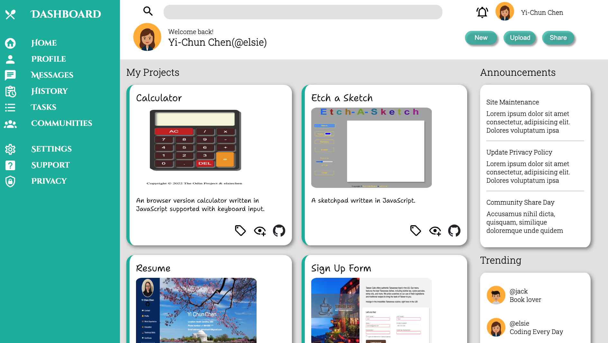

# Admin-Dashboard
This is a full dashboard design using grid and flexbox for layout work.

## Table of Contents
- Demo
- Technologies Used
- Credits
## Demo
Check out the [**live**](https://elsiechen.github.io/Admin-Dashboard/
) demo.

## Technologies Used
- HTML
- CSS

## Credits
- The Odin Project: [Admin Dashboard](https://www.theodinproject.com/lessons/node-path-intermediate-html-and-css-admin-dashboard)

- Icon by [Material Design Icons]
(https://pictogrammers.com/library/mdi/)

- Fonts from [Google fonts]
(https://fonts.google.com/)

- Character avatar icons from [pngtree]
(https://pngtree.com/so/character-avatars-icons)